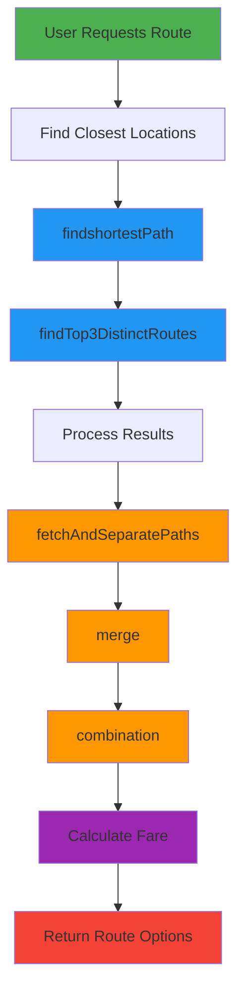

# Core Algorithms

## Route Finding Algorithms

The TravX application implements custom route finding algorithms that work with a precomputed SQLite database of routes. These algorithms are designed to find optimal paths between locations while considering multiple transportation modes.

### 1. findTop3DistinctRoutes(start, end)

This function finds up to 3 distinct routes between a start and end point using a depth-first search approach with pruning optimizations.

#### Algorithm Overview

```javascript
export const findTop3DistinctRoutes = async (start, end) => {
  const db = await SQLite.openDatabaseAsync("routes.db");
  const routeCache = new Map();
  const bestRoutes = [];
  const visitedStates = new Map();
  const MAX_DISTANCE_DIFFERENCE = 2; // 2 km maximum difference allowed

  const dfs = async (currentNode, path, totalDistance, visited) => {
    const stateKey = `${currentNode}-${Array.from(visited).join(",")}`;
    if (
      visitedStates.has(stateKey) &&
      visitedStates.get(stateKey) <= totalDistance
    )
      return;
    visitedStates.set(stateKey, totalDistance);

    // If shortest route exists and current distance exceeds shortest + MAX_DISTANCE_DIFFERENCE, stop exploring
    if (
      bestRoutes.length > 0 &&
      totalDistance > bestRoutes[0].totalDistance + MAX_DISTANCE_DIFFERENCE
    ) {
      return;
    }

    if (currentNode === end) {
      const newRoute = { path: [...path, end], totalDistance };
      updateBestRoutes(newRoute);
      return;
    }

    visited.add(currentNode);

    const connections = await getRoutesFrom(currentNode);
    const promises = connections.map(async (connection) => {
      const nextNode = connection.To;
      const distance = parseFloat(connection.distanceKm);
      if (!visited.has(nextNode)) {
        await dfs(
          nextNode,
          [...path, currentNode],
          totalDistance + distance,
          visited
        );
      }
    });
    await Promise.all(promises);

    visited.delete(currentNode); // Backtrack
  };

  const getRoutesFrom = async (from) => {
    if (routeCache.has(from)) return routeCache.get(from);

    const routes = await db.getAllAsync(
      'SELECT * FROM routes WHERE "From" = ?',
      from
    );
    routeCache.set(from, routes);
    return routes;
  };

  const updateBestRoutes = (newRoute) => {
    // If less than 3 routes, add if within distance limit
    if (bestRoutes.length < 3) {
      if (
        bestRoutes.length === 0 ||
        newRoute.totalDistance <=
          bestRoutes[0].totalDistance + MAX_DISTANCE_DIFFERENCE
      ) {
        bestRoutes.push(newRoute);
        bestRoutes.sort((a, b) => a.totalDistance - b.totalDistance);
      }
    } else if (
      newRoute.totalDistance <
        bestRoutes[bestRoutes.length - 1].totalDistance &&
      newRoute.totalDistance <=
        bestRoutes[0].totalDistance + MAX_DISTANCE_DIFFERENCE
    ) {
      bestRoutes.pop();
      bestRoutes.push(newRoute);
      bestRoutes.sort((a, b) => a.totalDistance - b.totalDistance);
    }
  };

  await dfs(start, [], 0, new Set());
  return bestRoutes;
};
```

#### Key Features

1. **Depth-First Search**: Uses DFS to explore all possible paths between start and end points
2. **Pruning**: Stops exploring paths that exceed the shortest path by more than 2km
3. **Caching**: Caches database queries to improve performance
4. **Diversity**: Ensures the returned routes are distinct from each other
5. **Optimization**: Uses memoization to avoid re-computing paths

#### Complexity Analysis

- Time Complexity: O(V + E) where V is the number of vertices and E is the number of edges
- Space Complexity: O(V) for storing visited nodes and recursion stack

### 2. findshortestPath(start, end)

This function implements a shortest path algorithm similar to Dijkstra's algorithm using a priority queue.

#### Algorithm Overview

```javascript
export const findshortestPath = async (start, end) => {
  const db = await SQLite.openDatabaseAsync("routes.db");
  const routeCache = new Map();
  const bestRoutes = [];
  const visitedStates = new Map();
  const MAX_DISTANCE_DIFFERENCE = 2;

  const priorityQueue = [];

  // Helper function to manage the priority queue
  const enqueue = (node, totalDistance, path) => {
    priorityQueue.push({ node, totalDistance, path });
    priorityQueue.sort((a, b) => a.totalDistance - b.totalDistance);
  };

  const dequeue = () => priorityQueue.shift();

  const getRoutesFrom = async (from) => {
    if (routeCache.has(from)) return routeCache.get(from);
    const routes = await db.getAllAsync(
      'SELECT * FROM routes WHERE "From" = ?',
      from
    );
    routeCache.set(from, routes);
    return routes;
  };

  const updateBestRoutes = (newRoute) => {
    // If fewer than 3 routes, add if within distance limit
    if (bestRoutes.length < 3) {
      if (
        bestRoutes.length === 0 ||
        newRoute.totalDistance <=
          bestRoutes[0].totalDistance + MAX_DISTANCE_DIFFERENCE
      ) {
        bestRoutes.push(newRoute);
        bestRoutes.sort((a, b) => a.totalDistance - b.totalDistance);
      }
    } else if (
      newRoute.totalDistance <
        bestRoutes[bestRoutes.length - 1].totalDistance &&
      newRoute.totalDistance <=
        bestRoutes[0].totalDistance + MAX_DISTANCE_DIFFERENCE
    ) {
      bestRoutes.pop();
      bestRoutes.push(newRoute);
      bestRoutes.sort((a, b) => a.totalDistance - b.totalDistance);
    }
  };

  const dfs = async () => {
    enqueue(start, 0, []); // Start with the initial node

    while (priorityQueue.length > 0) {
      const { node, totalDistance, path } = dequeue();

      // Avoid revisiting nodes if the total distance is not optimal
      if (visitedStates.has(node) && visitedStates.get(node) <= totalDistance) {
        continue;
      }

      visitedStates.set(node, totalDistance);

      // If we reached the end node, update the best routes
      if (node === end) {
        const newRoute = { path: [...path, end], totalDistance };
        updateBestRoutes(newRoute);
        if (bestRoutes.length === 3) return; // Stop early if we have 3 routes
      }

      const connections = await getRoutesFrom(node);

      // Explore all the connections from the current node
      for (const connection of connections) {
        const nextNode = connection.To;
        const distance = parseFloat(connection.distanceKm);

        if (
          !visitedStates.has(nextNode) ||
          visitedStates.get(nextNode) > totalDistance + distance
        ) {
          enqueue(nextNode, totalDistance + distance, [...path, node]);
        }
      }
    }
  };

  await dfs();
  return bestRoutes;
};
```

#### Key Features

1. **Priority Queue**: Uses a priority queue to always explore the shortest path first
2. **Early Termination**: Stops when 3 routes have been found
3. **Optimization**: Avoids revisiting nodes with worse distances
4. **Caching**: Caches database queries for performance

#### Complexity Analysis

- Time Complexity: O((V + E) log V) where V is vertices and E is edges
- Space Complexity: O(V) for storing the priority queue and visited states

## Route Processing Algorithms

### 1. fetchAndSeparatePaths(path)

Retrieves detailed route segment information from the database and separates routes by transportation mode.

#### Algorithm Overview

```javascript
export const fetchAndSeparatePaths = async (path) => {
  const db = await SQLite.openDatabaseAsync("routes.db");
  if (!Array.isArray(path) || path.length === 0) {
    console.error("Invalid path provided to fetchAndSeparatePaths");
    return [];
  }

  const queries = path.map((from, i) =>
    i < path.length - 1
      ? db.getFirstAsync(
          'SELECT * FROM routes WHERE "From" = ? AND "To" = ?;',
          path[i],
          path[i + 1]
        )
      : null
  );
  const results = await Promise.all(queries);

  const separated = [];
  for (const currentData of results) {
    if (!currentData) continue;

    const vehicles = currentData.Vehicles.replace(/[\[\]]/g, "")
      .split(",")
      .map((vehicle) => vehicle.trim());
    for (const vehicle of vehicles) {
      separated.push({
        From: currentData.From,
        To: currentData.To,
        Vehicle: vehicle,
        distance: currentData.distanceKm,
        used: false,
      });
    }
  }

  return separated;
};
```

### 2. merge(docs)

Combines consecutive segments with the same transportation mode to create more efficient routes.

#### Algorithm Overview

```javascript
export const merge = async (docs) => {
  if (!Array.isArray(docs) || docs.length === 0) {
    console.error("Invalid documents provided to merge");
    return [];
  }

  const mergedResults = [];
  const usedIndices = new Set();

  for (let i = 0; i < docs.length; i++) {
    if (usedIndices.has(i)) continue;

    let currentDoc = { ...docs[i] };

    for (let j = 0; j < docs.length; j++) {
      if (i !== j && !usedIndices.has(j)) {
        if (
          currentDoc.To === docs[j].From &&
          currentDoc.Vehicle === docs[j].Vehicle &&
          currentDoc.Vehicle !== "Walk" &&
          docs[j].Vehicle !== "Walk"
        ) {
          currentDoc.To = docs[j].To;
          currentDoc.distance += docs[j].distance;
          usedIndices.add(j);
        }
      }
    }
    currentDoc.fare = await fare(currentDoc.distance, currentDoc.Vehicle);
    mergedResults.push(currentDoc);
  }
  return mergedResults;
};
```

### 3. combination(separate, merged, From, To)

Creates route combinations with different transportation modes to provide users with varied options.

#### Algorithm Overview

```javascript
export const combination = async (separate, merged, From, To) => {
  merged.sort((a, b) => b.distance - a.distance);
  const comb = [];

  const Frontadder = (doc) => {
    let currentDoc = doc;
    const temp2 = [];
    const visited = new Set();
    let safetyCounter = 0;
    while (currentDoc && currentDoc.From !== From && safetyCounter < 100) {
      if (visited.has(currentDoc.From)) break;
      visited.add(currentDoc.From);
      let temp = merged
        .filter((item) => item.To === currentDoc.From)
        .sort((a, b) => b.distance - a.distance);

      if (temp.length === 0) {
        temp = separate
          .filter((item) => item.To === currentDoc.From)
          .sort((a, b) => b.distance - a.distance);
      }
      if (temp.length === 0) break;
      temp2.push(temp[0]);
      const checkAgain = merged.filter(
        (item) =>
          item.From === temp[0].From &&
          item.To === temp[0].To &&
          item.Vehicle !== temp[0].Vehicle
      );
      temp2.push(...checkAgain);
      currentDoc = temp[0];
      safetyCounter++;
    }
    return temp2;
  };

  const Backadder = (doc) => {
    let currentDoc = doc;
    const temp2 = [];
    const visited = new Set();
    let safetyCounter = 0;
    while (currentDoc && currentDoc.To !== To && safetyCounter < 100) {
      if (visited.has(currentDoc.To)) break;
      visited.add(currentDoc.To);
      let temp = merged
        .filter((item) => item.From === currentDoc.To)
        .sort((a, b) => b.distance - a.distance);
      if (temp.length === 0) {
        temp = separate
          .filter((item) => item.From === currentDoc.To)
          .sort((a, b) => b.distance - a.distance);
      }
      if (temp.length === 0) break;
      temp2.push(temp[0]);
      const checkAgain = merged.filter(
        (item) =>
          item.From === temp[0].From &&
          item.To === temp[0].To &&
          item.Vehicle !== temp[0].Vehicle
      );
      temp2.push(...checkAgain);
      currentDoc = temp[0];
      safetyCounter++;
    }
    return temp2;
  };

  const chainer = (arr) => {
    const temp2 = [];
    const starter = arr.filter((item) => item.From === From);
    if (starter.length === 0) return temp2;
    temp2.push(...starter);
    let currentDoc = starter[0];
    const visited = new Set();
    let safetyCounter = 0;
    while (currentDoc && currentDoc.To !== To && safetyCounter < 200) {
      if (visited.has(currentDoc.To)) break;
      visited.add(currentDoc.To);
      const temp = arr.filter((item) => item.From === currentDoc.To);
      if (temp.length === 0) break;
      temp2.push(...temp);
      currentDoc = temp[0];
      safetyCounter++;
    }
    return temp2;
  };

  let j = 0;
  for (let i = 0; i < merged.length; i++) {
    if (j === 2) break;
    const temp = [];
    const similer = merged.filter(
      (item) =>
        item.From === merged[i].From &&
        item.To === merged[i].To &&
        item.Vehicle !== merged[i].Vehicle
    );
    temp.push(merged[i]);
    temp.push(...similer);
    i += similer.length;

    const r1 = Frontadder(merged[i]);
    temp.unshift(...r1);

    const r2 = Backadder(merged[i]);
    temp.push(...r2);

    const exists = comb.some((existingComb) =>
      temp.every((item) =>
        existingComb.some(
          (existingItem) =>
            existingItem.From === item.From &&
            existingItem.To === item.To &&
            existingItem.Vehicle === item.Vehicle
        )
      )
    );

    if (!exists) {
      const starter = temp.find((item) => item.From === From);
      const ender = temp.find((item) => item.To === To);
      if (starter && ender) {
        const temp2 = chainer(temp);
        comb.push(temp2);
        j++;
      }
    }
  }

  return comb;
};
```

## Fare Calculation Algorithm

### fare(distance, vehicle)

Calculates the fare for a given distance and transportation mode.

#### Algorithm Overview

```javascript
export const fare = async (distance, vehicle) => {
  const db = await SQLite.openDatabaseAsync("routes.db");
  try {
    const fareData = await db.getAllAsync(
      "SELECT * FROM Fare Where Vehicle = ?",
      [vehicle]
    );

    if (fareData.length === 0) {
      return 0;
    }

    const fareInfo = fareData[0];
    let calculatedFare =
      parseFloat(fareInfo.base_fare) +
      parseFloat(fareInfo.cost_per_km) * distance;

    if (calculatedFare < parseFloat(fareInfo.minimum_fare)) {
      calculatedFare = parseFloat(fareInfo.minimum_fare);
    }

    return calculatedFare;
  } catch (error) {
    console.error("Error calculating fare:", error);
    return 0;
  }
};
```

## Algorithm Flow Diagram



## Performance Optimizations

1. **Caching**: Database queries are cached to avoid repeated lookups
2. **Pruning**: Path exploration is pruned when distances exceed thresholds
3. **Batch Processing**: Multiple database queries are batched for efficiency
4. **Early Termination**: Algorithms terminate early when sufficient results are found
5. **Sorting**: Results are pre-sorted to optimize subsequent processing

## Edge Cases Handled

1. **No Routes Found**: Gracefully handles cases where no routes exist between points
2. **Invalid Inputs**: Validates input parameters to prevent errors
3. **Database Errors**: Handles database connection and query errors
4. **Circular Paths**: Prevents infinite loops in path exploration
5. **Disconnected Graphs**: Handles cases where parts of the route network are disconnected

These algorithms form the core intelligence of the TravX application, enabling it to provide users with optimal and diverse route options based on their preferences and requirements.