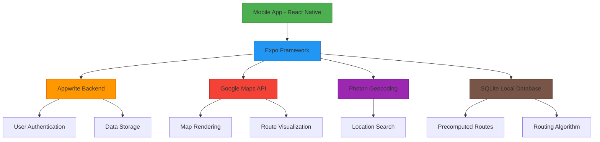

# TravX - Smart Route Planning Application

## Project Overview

TravX is a smart route planning mobile application built with React Native and Expo. The application helps users find optimal routes from their current location to a destination using a combination of Google Maps and Photon geocoding services. The app features real-time tracking, multiple route options, offline saving capabilities, and an interactive map interface.

## Key Features

1. **Route Optimization**: Calculates the most efficient routes based on distance, time, and traffic conditions
2. **Interactive Maps**: Explore routes with zoom, pan, and multi-touch gestures using Google Maps
3. **Multiple Route Options**: Displays up to 3 distinct routes tailored to user preferences
4. **Offline Mode**: Save favorite routes for offline access (currently in testing)
5. **Smart Search**: Find locations quickly with real-time suggestions powered by Photon
6. **Customizable Map Layers**: Switch between standard and hybrid map views
7. **Real-Time Tracking**: Track location and heading in real-time with smooth animations
8. **Route Preview**: Preview routes in Google Maps WebView before starting the journey

## Technology Stack

- **Frontend**: React Native with Expo
- **Maps**: react-native-maps with Google Maps integration
- **Geolocation**: expo-location for device location services
- **Backend**: Appwrite for user authentication and data storage
- **Routing Engine**: Custom algorithm using SQLite database with precomputed routes
- **UI Components**: Custom-built components for consistent user experience

## Architecture Overview



## Core Components

### 1. Main Application Structure

The application follows a tab-based navigation structure:

- **Home Tab** (`app/(tabs)/home.jsx`): Main dashboard with search functionality, recent places, and recommendations
- **Route Tab** (`app/(tabs)/route.jsx`): Route calculation, map display, and navigation features
- **Authentication** (`app/(auth)`): Sign-in and sign-up screens
- **Additional Screens**: Advertisement, travel places, and verification screens

### 2. Key Libraries and Services

- **react-native-maps**: For displaying interactive maps and route visualization
- **expo-location**: For retrieving device location and tracking
- **react-native-appwrite**: For backend services including authentication and data storage
- **expo-sqlite**: For local database storage of precomputed routes
- **react-native-webview**: For displaying Google Maps previews

## Routing Algorithm

The core of TravX is its custom routing algorithm that works with a precomputed SQLite database of routes. The algorithm consists of:

1. **findTop3DistinctRoutes**: Finds up to 3 distinct routes between start and end points
2. **findshortestPath**: Implements a shortest path algorithm using Dijkstra's approach
3. **fetchAndSeparatePaths**: Retrieves route segments from the database
4. **merge**: Combines similar transportation segments
5. **combination**: Creates route combinations with different transportation modes

## Data Flow


## Sample Data Structure

### Route Database Schema

The application uses a SQLite database with the following tables:

1. **routes**: Contains precomputed route segments
   - From (TEXT): Starting location identifier
   - To (TEXT): Destination location identifier
   - Vehicles (TEXT): Comma-separated list of transportation modes
   - distanceKm (REAL): Distance in kilometers

2. **Fare**: Contains fare information for different transportation modes
   - Vehicle (TEXT): Transportation mode
   - base_fare (REAL): Base fare amount
   - cost_per_km (REAL): Cost per kilometer
   - minimum_fare (REAL): Minimum fare amount

### Example Route Entry

```json
{
  "From": "Dhaka",
  "To": "Chittagong",
  "Vehicles": "[Bus, Train]",
  "distanceKm": 245.5
}
```

## API Integration

### Google Maps
- Used for map rendering and visualization
- Provides satellite and hybrid map views
- Integrated through react-native-maps

### Photon API
- Used for location search and geocoding
- Provides real-time location suggestions
- Replaces the need for Google Places API in some scenarios

### Appwrite
- Handles user authentication
- Manages user data and preferences
- Stores saved routes and history

## Environment Configuration

The application requires the following environment variables:

```bash
# Google Maps API Key (for preview, dev build or production)
GOOGLE_MAPS_API_KEY=your_api_key_here
```

## Installation and Setup

1. Clone the repository
2. Install dependencies with `npm install` or `yarn install`
3. Set up environment variables in a `.env` file
4. Run the app with `expo start`

## Future Considerations

Since development of this application will be discontinued, here are some considerations for future developers:

1. The routing algorithm is optimized for a specific region (appears to be Bangladesh based on the code)
2. The SQLite database needs to be expanded for broader geographic coverage
3. The UI components are modular and can be easily customized
4. The Appwrite integration can be replaced with other backend services if needed
5. The routing algorithm could be enhanced with real-time traffic data