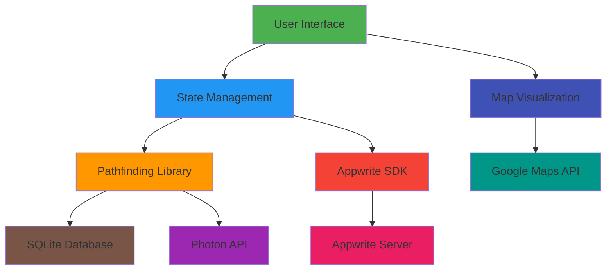
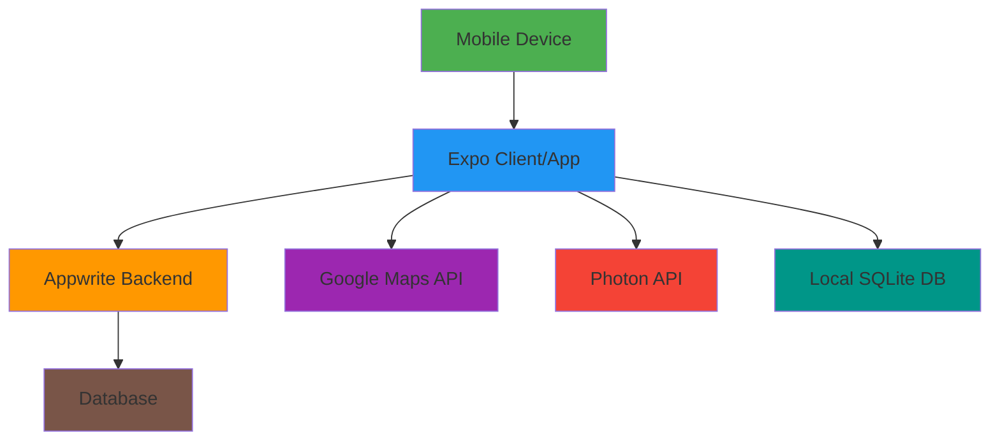

# Technical Architecture

## System Components

### 1. Frontend Layer (React Native)

The frontend is built using React Native with Expo, providing a cross-platform mobile experience for both iOS and Android devices.

#### Main Navigation Structure

The application uses a tab-based navigation system with the following structure:

```
App Root
├── Authentication Stack
│   ├── Sign In Screen
│   └── Sign Up Screen
├── Main Tabs
│   ├── Home Tab
│   └── Route Tab
└── Additional Screens
    ├── Advertisement
    ├── Travel Places
    └── Verification
```

#### Core UI Components

1. **MapView Component** (`components/MapView.jsx`)
   - Renders interactive maps using react-native-maps
   - Displays routes with polylines
   - Supports multiple map types (standard, hybrid)
   - Handles user interactions (tap, long press)

2. **Search Components**
   - SearchModal (`components/SearchModal.jsx`): Handles location search functionality
   - HistoryPicker (`components/HomeComponents/HistoryPicker.jsx`): Displays recently searched locations

3. **Route Display Components**
   - RouteDisplay (`components/RouteDisplay.jsx`): Shows route information and options
   - RouteBottomSheet (`components/RouteBottomSheet.jsx`): Displays route details in a bottom sheet
   - Direction (`components/Direction.jsx`): Shows turn-by-turn directions

4. **Home Screen Components**
   - RecentPlaces (`components/HomeComponents/RecentPlaces.jsx`): Displays recently visited places
   - TourismPlaces (`components/HomeComponents/TourismPlaces.jsx`): Shows tourism recommendations
   - Lifestyle (`components/HomeComponents/Lifestyle.jsx`): Displays lifestyle-related places

### 2. Business Logic Layer

#### Pathfinding Library (`lib/pathfinder.js`)

This is the core of the application's routing functionality. It contains several key functions:

1. **findTop3DistinctRoutes(start, end)**
   - Finds up to 3 distinct routes between start and end points
   - Uses a depth-first search algorithm with distance constraints
   - Maintains a cache of previously computed routes for performance

2. **findshortestPath(start, end)**
   - Implements a shortest path algorithm (similar to Dijkstra's)
   - Uses a priority queue for efficient path exploration
   - Returns the top 3 shortest paths

3. **fetchAndSeparatePaths(path)**
   - Retrieves detailed route segment information from the database
   - Separates routes by transportation mode

4. **merge(docs)**
   - Combines consecutive segments with the same transportation mode
   - Calculates total distance and fare for merged segments

5. **combination(separate, merged, From, To)**
   - Creates route combinations with different transportation modes
   - Builds complete routes from individual segments

#### Database Integration (`lib/db.js`)

Handles all database operations using expo-sqlite:

1. **Database Initialization**
   - Opens connection to local SQLite database
   - Initializes tables if they don't exist

2. **Data Retrieval**
   - Queries route information from the database
   - Retrieves fare information for different transportation modes

#### Appwrite Integration (`lib/appwrite.js`)

Manages all interactions with the Appwrite backend:

1. **User Authentication**
   - Sign in and sign up functionality
   - Session management

2. **Data Management**
   - User profile management
   - History and recent places storage
   - Advertisement and visiting places retrieval

### 3. Data Layer

#### Local Database (SQLite)

The application uses a local SQLite database to store precomputed route information. This approach allows for fast route calculation without constant network requests.

**Database Schema:**

1. **routes table**
   ```sql
   CREATE TABLE routes (
     "From" TEXT,
     "To" TEXT,
     "Vehicles" TEXT,
     "distanceKm" REAL
   );
   ```

2. **Fare table**
   ```sql
   CREATE TABLE Fare (
     "Vehicle" TEXT,
     "base_fare" REAL,
     "cost_per_km" REAL,
     "minimum_fare" REAL
   );
   ```

#### Backend Services (Appwrite)

Appwrite provides cloud-based services including:

1. **Authentication**
   - User registration and login
   - Session management
   - Password recovery

2. **Database**
   - User profiles
   - Search history
   - Saved places
   - Application data (advertisements, visiting places)

## Data Flow Architecture



## State Management

The application uses React's built-in state management with useState and useContext hooks:

### Global Context (`context/GlobalProvider.js`)

Manages global application state including:
- User authentication status
- User profile information
- History and recent places
- Current location data

### Theme Context (`context/ThemeProvider.js`)

Manages the application's theme (light/dark mode):
- Theme preference
- Color schemes
- Component styling based on theme

## API Integrations

### Google Maps API

Used for map rendering and visualization:
- Map display with various options (standard, hybrid)
- Location markers
- Route polylines
- Map interactions (zoom, pan)

### Photon API

Used for location search and geocoding:
- Location search with autocomplete
- Reverse geocoding (coordinates to address)
- Place details retrieval

### Appwrite API

Used for backend services:
- User authentication (login, registration)
- Data storage and retrieval
- File storage for assets

## Performance Considerations

1. **Caching**: Route calculations are cached to avoid recomputation
2. **Database Indexing**: Proper indexing of database tables for fast queries
3. **Lazy Loading**: Components are loaded only when needed
4. **Memory Management**: Efficient handling of map data and route information
5. **Network Optimization**: Minimizing API calls through local database usage

## Security Considerations

1. **API Keys**: Proper handling of Google Maps API keys
2. **User Data**: Secure storage of user credentials and personal information
3. **Data Transmission**: Secure communication with backend services
4. **Input Validation**: Validation of user inputs to prevent injection attacks

## Error Handling

The application implements comprehensive error handling:
- Network error handling for API calls
- Database error handling for local storage
- User-friendly error messages
- Graceful degradation when services are unavailable

## Testing Strategy

1. **Unit Testing**: Individual component testing
2. **Integration Testing**: Testing interactions between components
3. **End-to-End Testing**: Simulating user workflows
4. **Performance Testing**: Ensuring smooth operation under load

## Deployment Architecture



## Scalability Considerations

1. **Database Growth**: Strategies for handling larger route databases
2. **User Base Expansion**: Handling increased user load on Appwrite backend
3. **Geographic Expansion**: Extending coverage to new regions
4. **Feature Enhancement**: Adding new functionality without performance degradation